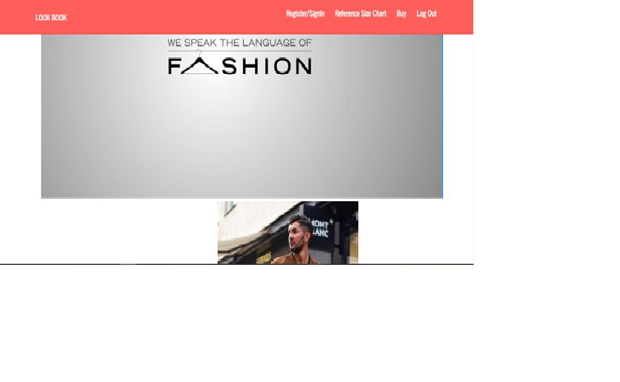
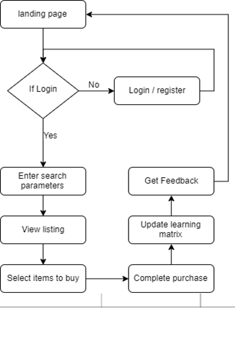
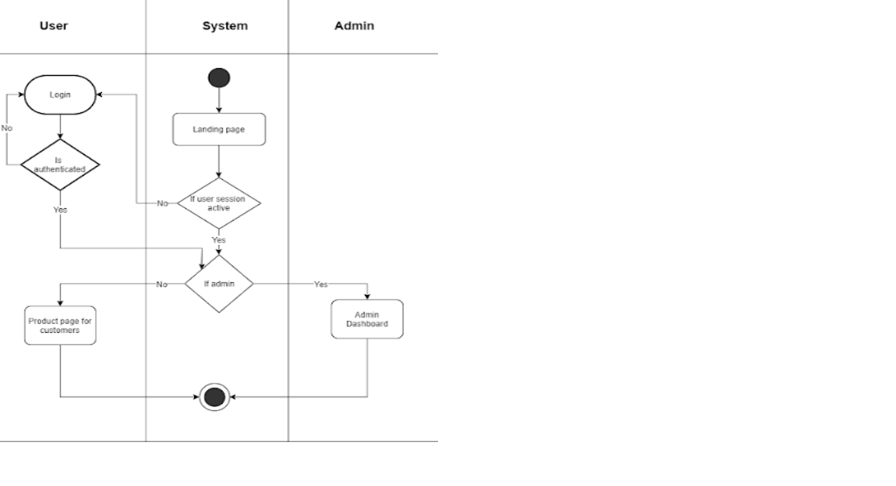
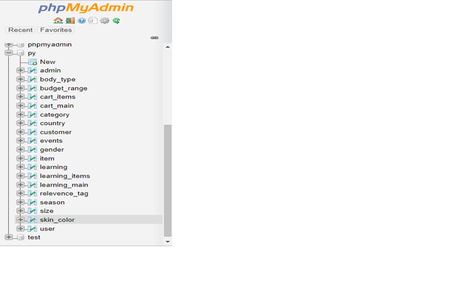
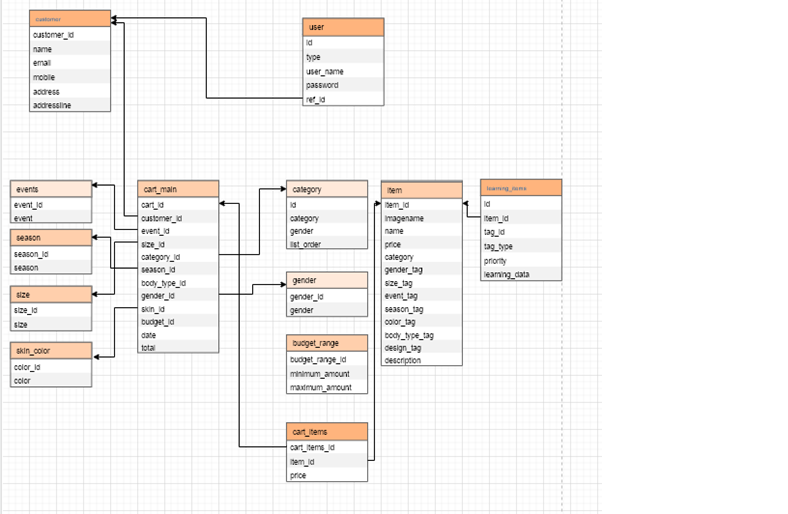
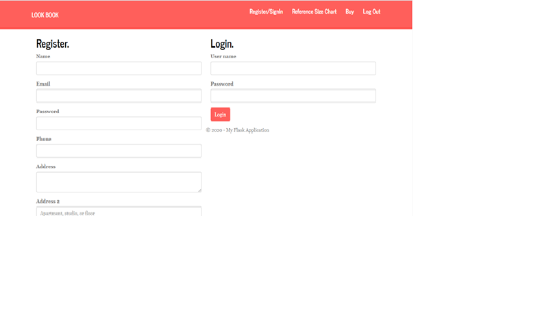
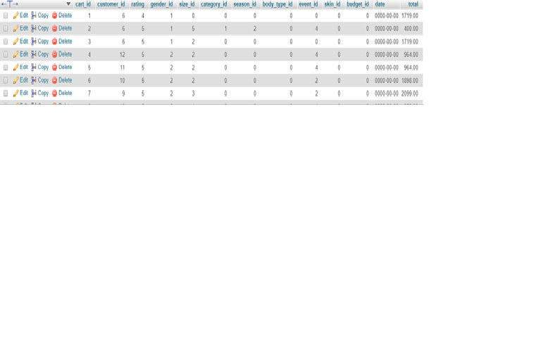
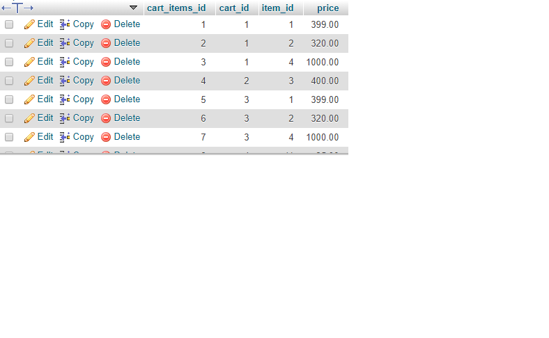
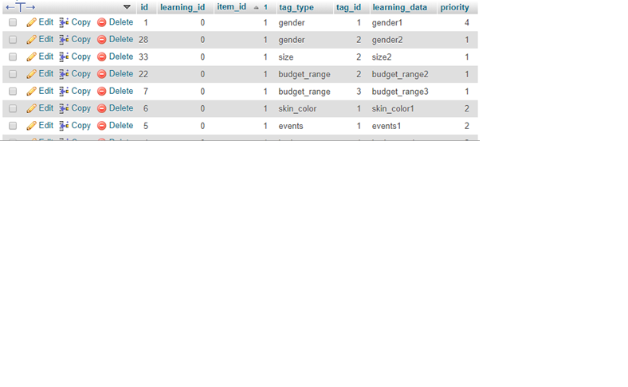
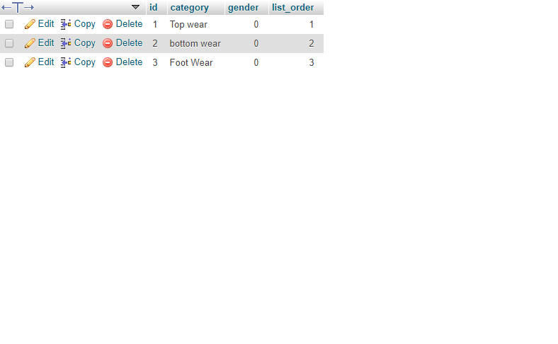

# Fashion-Lookbook-Dissertation

SYSTEM OVERVIEW:

As the idea is to develop a Lookbook which could help the users to get a complete look of their outfit based on their requirements, to prove this possibility we have created an E-Commerce web application.
First the user will enter the landing page of the Web application and if the user has visited the Web application first time then they will have to register if not then they can log in directly using their credentials.
For the look book to work, login is mandatory. Once login is successful, self-profiling based on the search parameters are completed. The system compares the filter values and maps it to the priority matrix used for prediction. The items with highest priority rating mapped under the filter results are then listed completing the look book. The user may then change individual items till satisfied and check all the items they want to purchase. This will automatically go to the cart. Once the addition is complete the system assumes the user will buy the items and after the user clicks on the affirmation of purchase, the new learning coefficients are updated in the priority matrix. The system then asks for feedback on the quality of prediction results.

OVERALL SYSTEM WORKFLOW.

SYSTEM DESIGN: 

We have implemented a simple overall model with basic features considering the working of and  Lookbook time constraints we have. There are 3 major workflows in the system design, all of them are explained in detail below.

LOGIN DASHBOARD CREATION:
As shown in Figure 9, this is an activity diagram for login dashboard. We have created a swim lane activity diagram involving three actors User, System and Admin. The first page of the web portal would be a landing page. There are 2 possibilities here, either the session was active as an admin/user or the session had expired. As the customer enters the Landing page, the system will check the condition if the session was active as an admin. If he/she has succeeded to login they will be guided to the Admin dashboard. If the condition fails then the system will redirect the customer to the buy product page. Going back to initial condition, if the session has expired. Then the customer will be guided to the Login page where they can enter credentials to log in, the back end will check if the user is admin. The condition explained earlier will continue and the system will redirect to buy products dashboard, if the customer is a normal user and not an Admin. If the credentials are admin then the condition repeats. If the user does not get authenticated at the Login page, then the system will ask to enter the credentials again.
 

DEVELOPMENT OF TECHNOLOGIES AND TOOLS:
3.7.1 Technologies: 
•	Core programming language: Python 3.7
•	Python platform: Flask
•	Database: MySQL
3.7.2 Development Environment:
•	Microsoft Visual Studio Community Edition 2019

•	XAMPP v 3.2.4
DATABASE DESIGN:

In Database design, all the stored procedures and tables were designed in the first phase. The researcher follows the first approach database for the design. The diagram has been drawn based on the inner relationships between entities Database diagram. Database designing process consists of various steps such as:
1)Finding the main purpose of the database.
2)Gather the required information.
3)Partition the information in the required tables.
4)Divide the information into columns.
5)Identify the primary keys for every table.
6)Organize the relationships of the tables.
7)The normalization rules are applied at the end. The database table is shown in the below 

DATABASE TABLE

ENTITY RELATIONSHIP(ER) DIAGRAM.

ARTEFACT DEVELOPMENT

VIEWS:

The landing page
The landing page is the main screen of the Web application. This page contains a menu bar which has options such as Register/Sign, Reference size chart, Buy and Logout. All the pages can be accessed from the landing page, which means the links to other screens should be mentioned in the menu bar.

THE LANDING PAGE.

Register/Sign in page:
For the new user, there is an option to create a new account. For the users who already have an account, they have an option to log in to the account. The credentials of the users are stored in the database and protected for security concerns. Under the register form, the mandatory details about the user needs to be filled. 
Log in page:

Under the login option, username and password fields needs to be entered. If the user is an admin then the admin credentials should be used. The credentials are checked in the back end, if they exist in the database then the user/ admin will be able to log in. Once the admin can log in, he/she will be able to add products or any categories that  are required. Only the admin will have access to the database where all the details, categories and the items will be stored. The change, update or delete functionalities can only be done by admin.

Reference Size chart:
The size chart is a static page where the measurements of the different sizes are mentioned. These details are for the just for information of the user. The users who are unaware of their body measurements can go through this chart and select the size required. 

REFERENCE SIZE CHART PAGE.

FASHION OUTFIT GENERATION:

Method for fashion outfit generation depends on the technique we have used to predict the outfit in this artefact. A priority matrix is implemented for the learning. This is a huge matrix column, where every column is associated with the input parameters selected by the users. And every row is associated with one unique identifier of each item. Based on the first few purchases, the priority matrix will be updated. We have filter co-efficient associated with every item. If the user searches for an outfit with same input parameters which has been purchased before, then the outfit with the highest priority under that search will be displayed first to the user followed by other outfits. If even 1 input parameter differs, then this will get added to the matrix and the learning will be done. As the purchase goes on, the priority matrix will keep updating.
The items purchased by the user are inserted in the table cart_main and the primary key is cart_id.

CART_MAIN TABLE.

The cart_main table does not contain the outfit which was purchased by the user. Because one user can have just one cart_id but one cart_id can have many numbers of items. Since one user can purchase any number of items the cart_id cannot be repeated in this table as it is the primary key. So, we create another table to include the cart_id called cart_items

CART_ITEMS TABLE

In this table, the cart_id can be repeated based on the repetitive purchases done by the user. And the item_id and price too are inserted to know which outfit was purchased by the user, the primary key of this table is cart_items_id.
After the complete purchase, to store the data and add or increase the priority matrix we use the table learning_items. The tag management is used here, every category is assigned a tag type. Once the input parameters for the purchase are recorded, the system will search for the tags. If the tag_id matches with the same item_id it will update the table and increment the priority matrix by 1. If tag_id does not match with item_id, in this case the input parameters might be different then the data will be inserted in the table and the priority will be changed to 1.

LEARNING_ITEMS TABLE.

The last step is to predict and sort the priority matrix, for this we are using the join function. We use inner join on category table and left join on learning_items table and sort the priority in descending order.

CATEGORY TABLE. 

